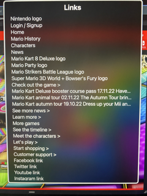
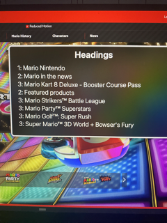

# Procesverslag
Markdown is een simpele manier om HTML te schrijven.  
Markdown cheat cheet: [Hulp bij het schrijven van Markdown](https://github.com/adam-p/markdown-here/wiki/Markdown-Cheatsheet).

Nb. De standaardstructuur en de spartaanse opmaak van de README.md zijn helemaal prima. Het gaat om de inhoud van je procesverslag. Besteedt de tijd voor pracht en praal aan je website.

Nb. Door *open* toe te voegen aan een *details* element kun je deze standaard open zetten. Fijn om dat steeds voor de relevante stuk(ken) te doen.

## Jij

  
uitwerken voor kick-off werkgroep

  ### Auteur:
  Robin Dekker

  #### Je startniveau:
  Mijn startniveau is rood, maar ik wil uiteindelijk uitkomen in zwart.

  #### Je focus:
  Mijn focus ligt beide op responsive en surface plane.
 

## Je website

  
uitwerken voor kick-off werkgroep

  ### Je opdracht:
  <a>https://mario.nintendo.com/characters/</a>

  #### Screenshot(s) van de eerste pagina (small screen): 
  hier de naam van de pagina  
  

  #### Screenshot(s) van de tweede pagina (small screen):
  hier de naam van de pagina  
  
 

## Toegankelijkheidstest 1/2 (week 1)

  
uitwerken na test in 1e werkgroep

  ### Bevindingen
  Lijst met je bevindingen die in de test naar voren kwamen:
  - Reduced Motion button
  - Buttons en articles zijn volledig klikbaar gemaakt
  - Duidelijke hovers
  

  #### Screenreader
  De screenreader is in het begin nog lastig om mee te werken. Door ctrl + option + U in te typen, krijg je een overzicht van de landmarks, links en headings op de pagina. Het klikken op een button kan ook nog lastig zijn als je niet weet waar de knoppen zitten. Verder is de webpagina wel goed ontworpen voor een screenreader, op een aantal kleine puntjes na.
  
  - De links zijn duidelijk, maar het zijn er wel veel. 
  - Bij de headings heb je alleen H1 en H2, er ontbreken er nog een paar.
  - De tekst in de articles wordt niet altijd voorgelezen.

  #### Muis en Toetsenbord 
  Je kan goed door de webpagina heen tabben. Er wordt duidelijk weergegeven waar je je bevindt door een gele rand om het element te plaatsen.
  
  - Het contrast met de gele rand is niet altijd even duidelijk.
  - Buttons worden wel duidelijk weergegeven.

  #### Motoriek (shocks, elastiekjes)
  Shocks: persoonlijk vond ik het erg moeilijk om mijn hand te bewegen met de shocks. Ze waren erg krachtig en ook wel pijnlijk. De webpagina is wel toegankelijk, omdat je vooral moet scrollen en lezen en er hoeft nergens getypt te worden. Articles zijn volledig klikbaar dus het is makkelijk om iets aan te klikken als je niet heel nauwkeurig bent. Dit geldt ook met de elastiekjes. De meeste buttons zijn ook groot en daarom makkelijk klikbaar.

  #### Visueel (brillen, contrast, kleurenblind, dark/light). 
  - Er is geen dark/light mode, maar dat is ook niet nodig. 
  - Het contrast van de tekst is goed, want het is meestal wit op een donkere achtergrond.
  - De afbeeldingen en achtergrond zijn vaak kleurrijk, dus dit kan soms moeilijk te zien zijn. Het contrast is hier soms laag.
  - De webpagina kent een duidelijke hiërarchie, dus het is makkelijk om elementen te vinden, ook als je het niet volledig kan zien.
  - De tekstgrootte is duidelijk, kan soms iets groter.

## Breakdownschets (week 1)

  
uitwerken na afloop 2e werkgroep

  ### de hele pagina: 
  

## Voortgang 1 (week 2)

  
uitwerken voor 1e voortgang

  ### Stand van zaken
  Het schrijven van de HTML ging goed. De opbouw van de pagina is duidelijk, vooral na het maken van de breakdownschets. De nav goed krijgen met css is nog lastig, maar na het maken van het huiswerk ging dit al beter. Het is belangrijk om nog een duidelijke structuur aan te brengen door middel van de headings. De afbeeldingen heb ik voor nu nog even achterwege gelaten.
  
  Ik heb ook al een begin gemaakt aan de css van de eerste pagina. Ik ben begonnen met de onderdelen die ik al begreep en dat ging goed. Voor nu staat het menu nog naast elkaar, maar later wil ik hier een hamburger menu van maken.
  
  Daarnaast heb ik het huiswerk elke keer bijgehouden. Ik heb veel geleerd van de opdrachten en kan het ook gelijk toepassen in mijn eigen website. Ik heb ervaren dat het belangrijk is om de opdrachten te blijven doen om het te begrijpen en kan daar ook veel voorbeelden uithalen. Wat ik niet meteen begrijp vraag ik vervolgens in de les en dan is het een stuk duidelijker. Ik moet er wel bij zeggen dat de opdrachten veel tijd kosten, maar de herhaling is goed om het te onthouden.

  ### Agenda voor meeting
  samen met je groepje opstellen

  | Marc     | Aya          | Mats    | Robin        |
  | ---            | ---                | ---          | ---              |
  | HTML en CSS kort laten zien voor feedback  | hoe zijn hier de h'tjes verdeeld (h1, h2, etc.)?            | plan opstellen ivm huiswerk bijhouden    | Kun je grid, flexbox en position door elkaar gebruiken? Of kan het ook anders?    |
  | - | - | - | Is mijn HTML goed uitgewerkt? Of wat mist er nog of kan beter? |

  Algemeen: Hamburger menu, Github (vullen we het goed in, zoals website link)

  ### Verslag van meeting
  hier na afloop snel de uitkomsten van de meeting vastleggen

  - Probeer de css selectoren korter te maken voor het overzicht, alleen uitschrijven als het nodig is.
  - Structuur houden binnen de css, zodat je het later makkelijk terug kan vinden.
  - Alleen divs gebruiken voor styling, niet voor andere dingen!
  
  - Grid, flexbox en position kunnen zeker door elkaar gebruikt worden.
  - HTML ziet er goed uit. Duidelijk verschil tussen sections en articles.
  - Voor Github vragen moet je bij de studentassistent zijn.
  - Hamburger menu wordt in de volgende lessen uitgelegd.

## Voortgang 2 (week 3)

  
uitwerken voor 2e voortgang

  ### Stand van zaken
  Deze week ben ik goed opweg met de css, maar er moet nog wel veel gedaan worden. Ook heb ik de HTML van de tweede pagina af. Alleen weet ik nog niet hoe ik de uitklaptekst wil gaan doen. Het kan met Details/Summary, dat moet ik nog even opzoeken. Het hamburger menu is ook gelukt na het maken van de opdrachten. Deze week heb ik veel tijd besteed aan het maken van de opdrachten en daardoor niet heel veel kunnen doen aan mijn eigen website. Ik heb wel weer veel geleerd dus dat kan ik goed toepassen.

  ### Agenda voor meeting
  samen met je groepje opstellen

  | Marc      | Aya          | Mats    | Robin      |
  | ---            | ---                | ---          | ---              |
  | Alleen code laten zien  | Je kan de content veranderen zoals bijvoorbeeld een hamburgermenu img naar een kruisje door 'content: url()' in je css te zetten. Alleen hoe doe je dat als je geen url hebt maar een svg afbeelding?             | -    | Code laten zien    |
  | Geen specifieke vragen | - | - | Is het haalbaar om responsive en surface plane te doen? |

  ### Verslag van meeting
  - Het is haalbaar om beide te doen, maar begin sowieso eerst met 1. Als je tijd over hebt kun je altijd meer doen.
  - Goed de opdrachten blijven bijhouden om het te begrijpen.
  - Details/summary opzoeken.

## Toegankelijkheidstest 2/2 (week 4)

  
uitwerken na test in 8e werkgroep

  ### Bevindingen
  - Contrast is goed, tekst is groot genoeg dus blijft leesbaar
  - Contrast op de paarse achtergrond is wat minder, maar nog wel leesbaar
  - Reduced motion button en andere buttons kunnen groter en moeten helemaal klikbaar zijn
  - Meer hovers gebruiken voor duidelijkheid
  - Reduced motion werkt wanneer je dit zelf instelt op jouw device.

  #### Screenreader
  De screenreader werkt goed en kan goed navigeren door de webpagina. 
  - Elke afbeelding heeft een alt-tekst.
  - Alle links zijn duidelijk en komen voor in het overzicht.
  - De headings zijn compleet.
  
  
  

  #### Muis en Toetsenbord 
  Je kan goed door de webpagina heen tabben. Er wordt duidelijk weergegeven waar je je bevindt door een gele rand om het element te plaatsen.

  #### Motoriek (shocks, elastiekjes)
  De webpagina is en was al toegankelijk, omdat je vooral moet scrollen en lezen en er hoeft nergens getypt te worden. Articles zijn volledig klikbaar dus het is makkelijk om iets aan te klikken als je niet heel nauwkeurig bent. Dit geldt ook met de elastiekjes. De links en buttons zijn ook groot en volledig klikbaar, wat het makkelijker maakt.

  #### Visueel (brillen, contrast, kleurenblind, dark/light). 
  - Met blurred vision zijn de afbeeldingen nog herkenbaar en zijn H1 en H2 nogsteeds leesbaar. Andere tekst helaas niet.
  - De tekst heeft een hoog contrast en is in alle gevallen nog steeds leesbaar.
  - Er is geen dark/light mode, aangezien het een kleurrijk ontwerp is.

## Voortgang 3 (week 4)

  
uitwerken voor 3e voortgang

  ### Stand van zaken
  Deze week heb ik veel vooruitgang geboekt en ben ik al bijna klaar. Ik loop iets achter met de opdrachten maar de onderdelen die belangrijk zijn voor mijn eigen website heb ik wel gemaakt en die kan ik ook goed gebruiken. De css voor beide pagina's is bijna af en ik heb ook JS toegevoegd. Ik moet alleen nog op een paar plekken de responsiveness verder uitwerken, maar ik weet hoe het werkt dus ik ben goed opweg. Wanneer dit klaar is, wil ik nog extra animaties toevoegen en ervoor zorgen dat onderdelen omhoog sliden wanneer je scrollt door de website. Daarnaast kijk ik deze week nog extra naar de buttons en de accessibility van de website.

  ### Agenda voor meeting
  samen met je groepje opstellen

  | Marc      | Mats          | Aya (ziek)    | Robin        |
  | ---            | ---                | ---          | ---              |
  | Code bekijken  | Code bekijken             |-    | mag ik een class gebruiken om een h1 visually hidden te maken?    |
  | Heeft mijn website voldoende variatie? | Is het gebruik van divs correct? | nog een punt | responsiveness op mijn 2e pagina werkt niet helemaal |
  | Mag ik var gebruiken als container rondom tags die wel syntax hebben?          | ...                | ...          |  is er genoeg variatie voor het surface deel of moet ik nog meer toevoegen              |
  | ---            | ---                | ---          | waarom ik maar op 1 button kan klikken en de andere buttons dan niet werken terwijl ze hetzelfde doen             |

  
  ### Verslag van meeting

  - Uitgebreidere JS toevoegen om alle buttons klikbaar te maken, met hulp van de docent
  - Tips om de responsiveness compleet te maken
  - Classes gebruiken mag wanneer het echt nodig is.
  - Er is niet een bepaald aantal elementen dat je nodig hebt voor de surface plane, de docent bepaald of het voldoende is, maar dat zie je ook wel.

## Eindgesprek (week 5)

  
uitwerken voor eindgesprek

  ### Je uitkomst - karakteristiek screenshots:
  
  
  
  
  
  

  ### Dit ging goed/Heb ik geleerd: 
  Waar ik het meest trots op ben, is dat ik heb geleerd hoe ik een menu kan laten in en uitklappen en dat het ook goed werkt. Daarnaast is het menu ook nog responsive. Dat is ook iets waar ik veel tijd in gestoken heb en dat ik nu goed kan.
  
  
  
  Daarnaast heb ik ook geleerd om elementen goed te positioneren, door middel van flexbox, grid en position te gebruiken. Ik beschik nu over veel meer vaardigheden om dit goed te doen en ik begrijp het ook. Na het maken van de opdrachten is flexbox en vooral grid veel duidelijker geworden en kan ik het nu meteen toepassen zonder voorbeeld.
  
  
  
  Ook kan ik nu buttons klikbaar maken met een paar simpele regels css + JS.
  
  
  
  

  ### Dit was lastig/Is niet gelukt:
  De meeste dingen gingen goed, maar er zijn twee dingen niet gelukt. Ten eerste is het de reduced motion button werkend maken. Reduced motion werkt wel wanneer je dit zelf instelt bij de instellingen van je device, maar er gebeurt niks wanneer je op de button klikt. Ik weet ook niet zo goed hoe ik dit wel werkend moet maken. Het leek me erg lastig dus voor nu heb ik het gelaten.
  
  
  
  Op de echte webpagina van Mario veranderen de plaatjes vanzelf na bepaalde tijd. Ik weet wel ongeveer hoe ik dit zou moeten doen met JS, maar dat is veel werk en hoort niet echt bij de opdracht van dit vak. Als ik meer tijd had zou ik dit wel nog verder willen uitwerken. Daar hoort ook bij dat je op de buttons kan klikken om handmatig de plaatjes te veranderen, dat werkt bij mij ook niet.
  

## Bronnenlijst

  
continu bijhouden terwijl je werkt

  Nb. Wees specifiek ('css-tricks' als bron is bijv. niet specifiek genoeg).

  1. (https://www.youtube.com/watch?v=T33NN_pPeNI&ab_channel=BeyondFireship) -> Om elementen naar boven te laten sliden als je scrollt
  2. Play button: https://css-tricks.com/making-pure-css-playpause-button/
  3. Button animaties: https://codepen.io/robertspier/pen/zYaeMKP?editors=1100

